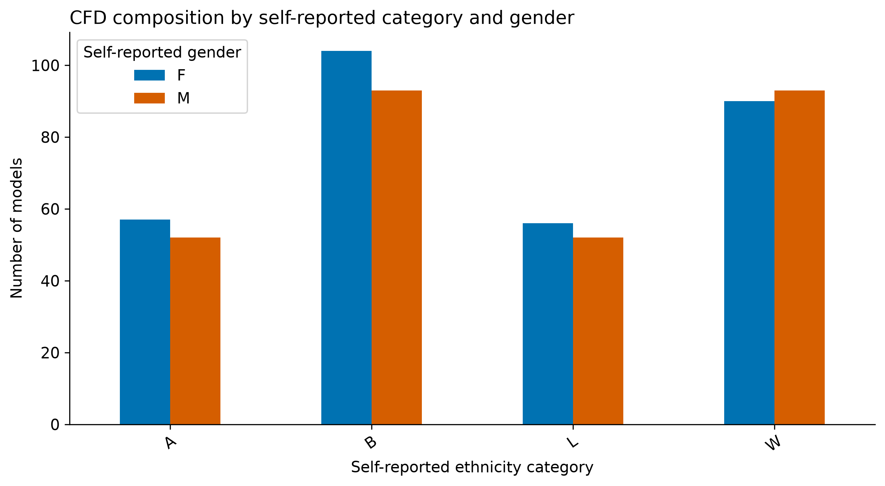
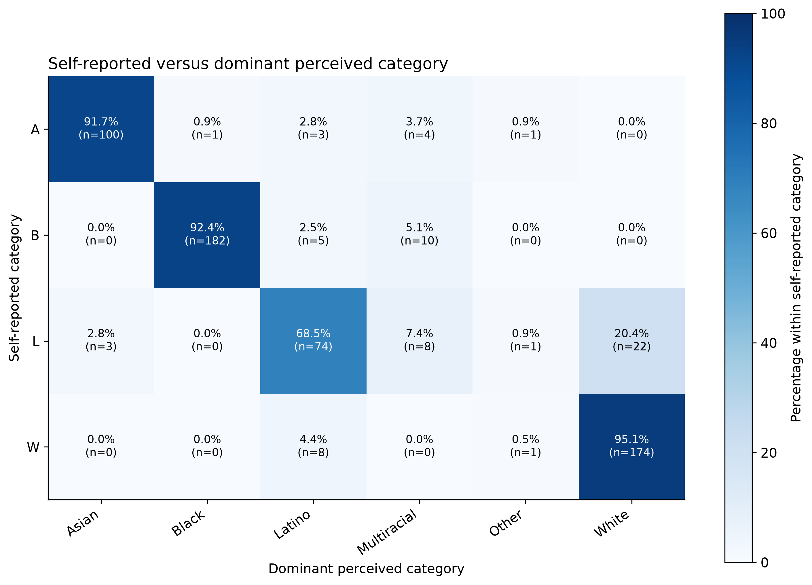
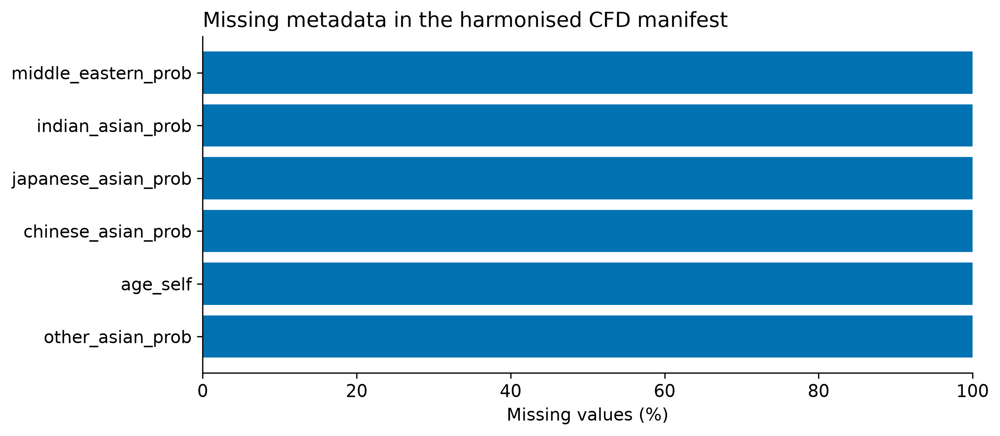
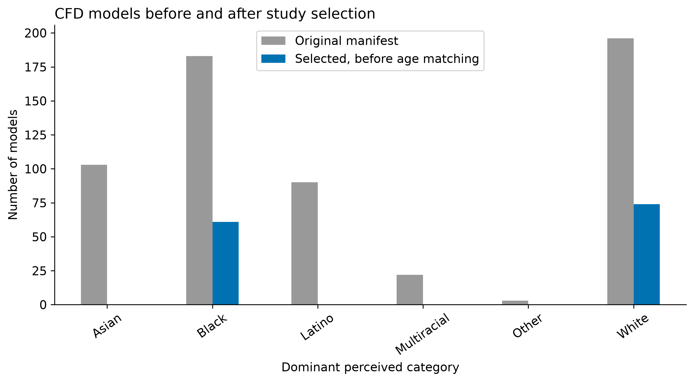
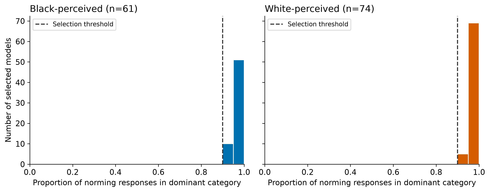
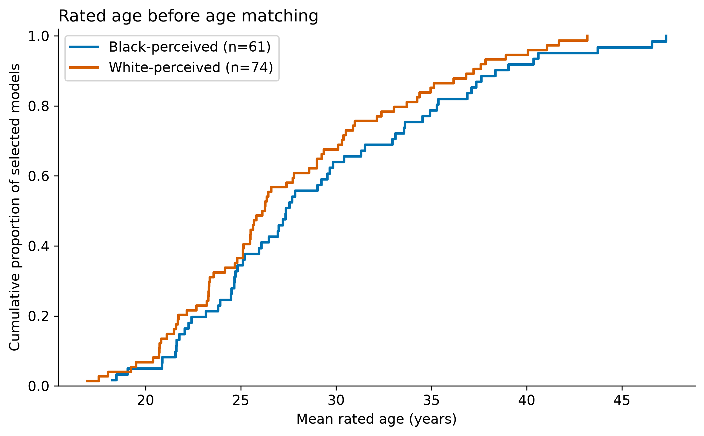

# Minority Estimation

This repository contains the stimulus preparation pipeline and experimental materials for a study on **minority estimation in social and non-social visual scenes**.

The project extends the minority estimation paradigm introduced by Kardosh et al. (2022) by comparing estimates made from grids of human faces with estimates made from visually analogous non-social stimuli.

The repository provides a reproducible stimulus-generation pipeline, three pilot experiments for JATOS, and aggregate quality-control tables and figures. Pilot data collection is underway.

---

## Study overview

Each participant completes one of three study conditions:

| Study condition | Stimuli presented | Main trials |
| --- | --- | ---: |
| Mixed | Face grids and grayscale circle grids | 90 |
| Social only | Face grids only | 45 |
| Non-social only | Grayscale circle grids only | 45 |

Each grid contains 64 elements arranged in an 8 × 8 layout.
Images are presented for 2 seconds, followed by a percentage
estimate using a continuous 0–100% slider. Participants have
10 seconds to submit each main-task estimate.

Nine compositions are used: 8, 14, 20, 26, 32, 38, 44, 50,
and 56 elements from the primary category out of 64.
Five versions per composition yield 45 face grids and
45 corresponding circle grids.

The three conditions use the same underlying stimulus set.
Experiment files are located in:

- `experiment/mixed/`
- `experiment/social_only/`
- `experiment/nonsocial_only/`

Generated matrices are shared in `experiment/images_matrices/`.

After the estimation task, participants complete a condition-specific
funnel debrief, presented one question at a time without a response
deadline. In conditions containing circles, open-ended association
questions precede an explicit question about interpreting circles
as representing Black or White people.

The perceived-threat questionnaires and the symbolic “separate group”
question have been removed from the pilot protocol.
The numerical estimate of the Black population in France and
the demographic questions remain.
---

## Face stimulus selection

Face stimuli are drawn from the **Chicago Face Database (CFD), Version 3.0**.

The current selection code retains models that:

- have self-reported gender `M`;
- have a dominant perceived-gender response proportion **strictly greater than 0.90**;
- have dominant perceived ethnicity **Black or White**, with a response proportion **at least 0.90**;
- have an associated local image.

The perceived-gender threshold is applied to the largest gender response proportion; the code does not separately require the dominant perceived label to be `M`. These criteria describe the current implementation.

CFD perceptual proportions describe norming responses, not classifier confidence scores.

This produces an initial eligible pool of:

```
Black-perceived male faces: 61
White-perceived male faces: 74
```

To obtain balanced groups, all 61 eligible Black-perceived faces are retained and 61 White-perceived faces are selected using **optimal one-to-one age matching without replacement**.

Matching is based on mean rated age (`age_rated` in the harmonised manifest) and minimizes the total absolute age difference between matched Black- and White-perceived faces using a minimum-cost assignment algorithm.

The final social stimulus pool therefore contains:

```
61 Black-perceived faces
61 White-perceived faces
122 faces total
```

The matching procedure is implemented in:

```
scripts/stimulus_preparation/02b_age_match_stimuli.py
```

using `scipy.optimize.linear_sum_assignment`.

Matching diagnostics include:

- mean rated age by group;
- rated-age standard deviation by group;
- mean absolute matched-pair age difference;
- median absolute matched-pair age difference;
- maximum absolute matched-pair age difference;
- standardized mean difference.

---

## Face-region extraction

Face regions are detected using **MediaPipe Face Landmarker**.

For each selected face:

1. facial landmarks are detected;
2. a convex hull is constructed around the detected landmarks;
3. this hull defines the face region used for luminance measurements;
4. the detected face area is measured in the final stimulus coordinate system.

Only the final age-matched set of **122 faces** is processed.

The implementation is located in:

```
scripts/stimulus_preparation/03_extract_faces.py
```

---

## Luminance estimation

Face-region luminance is calculated from pixels inside the MediaPipe-derived facial region using:

```
Y = 0.299R + 0.587G + 0.114B
```

For each face, both the mean and median face-region luminance are recorded.

The mean face-region luminance is subsequently used to determine the grayscale intensity of the corresponding non-social circle.

In the final matched stimulus set, the luminance distributions are non-overlapping:

```
Black-perceived faces
mean ≈ 99.88
range ≈ 74.24–126.47

White-perceived faces
mean ≈ 159.03
range ≈ 139.90–175.49
```

The gap between the highest Black-perceived face luminance and the lowest White-perceived face luminance is approximately:

```
13.44 grayscale units
```

Luminance diagnostics are generated by:

```
scripts/stimulus_preparation/03c_analyze_mean_luminance.py
```

---

## Non-social stimulus generation

The non-social condition uses grayscale circles to preserve selected visual properties while removing facial structure. Whether participants attribute social meaning to these circles is assessed through the pilot debrief.

Each circle is displayed within a:

```
100 × 100 px
```

cell.

### Circle size

Circle size is calibrated empirically from the detected face areas.

For each face, the detected facial area is measured after applying the same crop and resize used for the final experimental stimulus.

The median face area across the final stimulus set is converted into the radius of an area-equivalent circle:

```
r = sqrt(A / π)
```

The resulting radius is rounded to the nearest pixel and used for all non-social circles.

Calibration is performed by:

```
scripts/stimulus_preparation/03b_analyze_face_area.py
```

and stored in:

```
data/interim/calibration/face_area_calibration.json
```

### Circle intensity

Each non-social circle directly inherits the mean luminance of its corresponding social face stimulus.

For face `i`:

```
I_i = round(L_i)
```

where:

- `L_i` is the mean luminance of the detected face region;
- `I_i` is the grayscale intensity of the corresponding circle.

Values are constrained to the valid 8-bit interval:

```
[0, 255]
```

This preserves both between-group and within-group luminance variation observed in the social stimuli.

---

## Matrix generation

Final matrices are generated offline to avoid stimulus-generation delays during data collection.

For every target proportion:

1. Black-perceived and White-perceived faces are sampled from the final matched pool;
2. sampling is performed **without replacement within each matrix**;
3. the selected 64 stimuli are randomly shuffled;
4. faces are placed into an **8 × 8 grid**;
5. each face is displayed in a **100 × 100 px cell**;
6. a corresponding non-social matrix is generated using the same spatial organization.

Each social cell therefore has a corresponding non-social cell derived from the same underlying face stimulus.

Matrix generation is implemented in:

```
scripts/stimulus_preparation/04_generate_matrices.py
```

A fixed random seed is used for reproducibility.

---

## Repository structure

| Path | Contents |
| --- | --- |
| `src/minority_estimation/` | Reusable Python functions, schemas, validation and stimulus configuration |
| `scripts/stimulus_preparation/` | Metadata audit, stimulus selection, age matching, QC, extraction and matrix generation |
| `data/raw/cfd/` | Local CFD workbook and image inputs; excluded from Git |
| `data/interim/cfd_audit/` | Harmonised manifest and audit summaries |
| `data/interim/matching/` | Age-matching diagnostics |
| `data/interim/faces_only/` | Extracted face outputs; excluded from Git |
| `data/interim/calibration/` | Face-area and luminance calibration outputs |
| `data/processed/` | Eligible and age-matched stimulus manifests |
| `experiment/mixed/` | HTML, JavaScript and CSS for the mixed condition |
| `experiment/social_only/` | HTML, JavaScript and CSS for faces only |
| `experiment/nonsocial_only/` | HTML, JavaScript and CSS for circles only |
| `experiment/images_matrices/` | Generated paired matrices; excluded from Git |
| `models/face_landmarker.task` | MediaPipe model asset |
| `results/stimulus_qc/audit_and_selection/` | Aggregate audit and selection figures, tables and explanatory README |
| `results/stimulus_qc/face_luminance_distribution.png` | Luminance QC figure |
| `pyproject.toml`, `requirements.txt` | Package configuration and dependencies |

Generated `*.egg-info/` directories are excluded from Git.

---

## Installation

Python 3.10–3.12 is recommended.

Create and activate a virtual environment:

```bash
python3.12 -m venv .venv
source .venv/bin/activate
```

Install the project:

```bash
python -m pip install -e .
```

Install the required dependencies:

```bash
python -m pip install -r requirements.txt
python -m pip install matplotlib
```

---

## Running the stimulus pipeline

Run all scripts from the repository root.

### 1. Audit the CFD metadata

```bash
python scripts/stimulus_preparation/01_audit_cfd_manifest.py
```

### 2. Build the eligible stimulus pool

```bash
python scripts/stimulus_preparation/02_build_stimuli.py
```

### 3. Generate audit and selection QC

```bash
python scripts/stimulus_preparation/02c_plot_stimulus_qc.py
```

This script reads the outputs of steps 01 and 02. Its summaries describe the **135 eligible stimuli before age matching**, not the final 122-face pool.

### 4. Perform age matching

```bash
python scripts/stimulus_preparation/02b_age_match_stimuli.py
```

### 5. Extract faces and compute luminance

```bash
python scripts/stimulus_preparation/03_extract_faces.py
```

### 6. Calibrate circle size

```bash
python scripts/stimulus_preparation/03b_analyze_face_area.py
```

### 7. Inspect luminance distributions

```bash
python scripts/stimulus_preparation/03c_analyze_mean_luminance.py
```

### 8. Generate experimental matrices

```bash
python scripts/stimulus_preparation/04_generate_matrices.py
```

---

## Generated matrix structure

Each matrix is stored under:

```text
experiment/images_matrices/<rounded_percentage>pct_black/mb<count>_n64_v<version>/
```

For example, composition 8/64, version 1 is stored in `12pct_black/mb08_n64_v01/`.

| File | Contents |
| --- | --- |
| `face.png` | Social grid |
| `circles.png` | Corresponding grayscale circle grid |
| `cells.csv` | Cell identity, category, luminance and position |
| `metadata.json` | Composition and generation parameters |

Folder percentages use Python's `round()` rule: exact half values are rounded to the nearest even integer. For the nine compositions, folder prefixes are **12, 22, 31, 41, 50, 59, 69, 78 and 88**. JavaScript uses the same rule for file lookup. This rounding affects folder names only; true stimulus percentages retain their exact values.

The social and non-social matrices share the same cell-level composition and spatial arrangement.

---

## Audit and selection results

The harmonised manifest contains **597 models**. Dominant perceived categories are White (196), Black (183), Asian (103), Latino (90), Multiracial (22) and Other (3). Selection produces **135 eligible models: 61 Black-perceived and 74 White-perceived**.

Browse the [QC results and aggregate CSV tables](results/stimulus_qc/audit_and_selection/README.md). Each figure is available as PNG and PDF.

### Database composition



### Self-reported and perceived categories



Percentages are calculated within each self-reported category; counts are displayed in each cell. This describes correspondence between category systems, not classification accuracy.

### Missing metadata



Missingness is assessed in the harmonised table, rather than across every column of the original workbook.

### Selection counts



This compares the original manifest with the eligible pool. It does not isolate the contribution of individual exclusion criteria.

### Perceptual response proportions



The dashed line marks the category-selection threshold. These values are proportions of CFD norming responses.

### Rated age before matching



This figure describes the eligible pool **before** age matching. Age summary statistics are provided in the accompanying CSV.

---

## Running the pilot experiments in JATOS

Place the contents of the repository's `experiment/` directory in the study assets root. The three condition folders and `images_matrices/` must be siblings.

| Condition | Component HTML file path | CSS reference | Experiment script reference |
| --- | --- | --- | --- |
| Mixed | `mixed/index.html` | `mixed/style.css` | `mixed/script.js` |
| Social only | `social_only/index.html` | `social_only/style.css` | `social_only/script.js` |
| Non-social only | `nonsocial_only/index.html` | `nonsocial_only/style.css` | `nonsocial_only/script.js` |

These versions use paths relative to the JATOS study assets root. All three scripts load matrices from `images_matrices/...`; the HTML loads the JATOS library with `src="jatos.js"`. Direct browsing of the nested HTML through a generic static server requires a separate path configuration.

Each participant completes **one condition**. Having three components in one JATOS study does not, by itself, randomly assign participants to them. Configure study entry links or an explicit assignment mechanism accordingly.

Exports identify the condition through `study_version`: `mixed`, `social_only` or `nonsocial_only`. They include training and main-task responses, requested categories, true percentages, response times and timeouts, funnel-debrief answers, population estimates, demographics, and the technical/Prolific metadata collected by the scripts.

Check the Prolific completion code for each deployed study. Validate asset loading, saving and completion redirection in JATOS before using a newly deployed version. GitHub pushes do not automatically update JATOS assets.

---

## Reproducibility

The stimulus-generation pipeline is designed to be deterministic and auditable.

Relevant provenance information includes:

- fixed experimental configuration;
- fixed random seed;
- explicit perceptual inclusion thresholds;
- age-matching diagnostics;
- face-detection outputs;
- face-area calibration;
- luminance summaries;
- cell-level matrix metadata;
- matrix-level metadata.

For a new stimulus version, regenerate downstream outputs whenever upstream selection criteria change. Preserve the exact stimuli, configuration and code version used for pilots already collected. Aggregate QC summaries do not establish that the CFD sample represents a population.

---

## Terminology

The experimental groups refer to **perceived race categories from the CFD norming data**, rather than self-identified racial categories.

Accordingly, this repository uses terms such as:

```
Black-perceived
White-perceived
```

when describing the experimental grouping variable.

The `age_rated` variable similarly refers to **mean rated age**, rather than the model's self-reported age.

---

## References

Ma, D. S., Correll, J., & Wittenbrink, B. (2015).  
The Chicago Face Database: A free stimulus set of faces and norming data.  
*Behavior Research Methods, 47*, 1122–1135.

Kardosh, R., et al. (2022).  
[Add full reference.]

Gayet, S., et al. (2022).  
[Add full reference.]

---

## Status

This repository is currently under active development as part of an academic research project.

Pilot data collection is underway for the three study conditions. Audit and selection QC results are available in `results/stimulus_qc/audit_and_selection/`.

